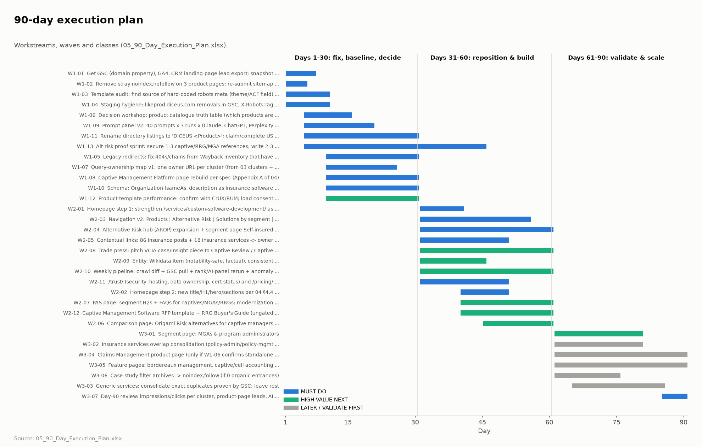

# 01 · Executive Strategy — DICEUS SEO & AI Search

*Prepared 2026-10-06 · Subject: https://diceus.com/ · Market: US, English · Evidence: public data only. GSC, GA4 and CRM are DATA UNAVAILABLE.*

## The situation in three sentences
DICEUS is becoming a product-led insurance software company, but diceus.com still reads as a custom-development agency to people, search engines and AI assistants. The one territory where DICEUS already wins organically and in AI answers is **captive insurance and risk retention groups**. The core pages for that territory are currently **excluded from Google by a stray `noindex` tag**. The fastest, lowest-risk path to growth is to fix that, build alternative risk out as the first complete product cluster, and re-weight the site toward products without a risky URL migration.

## Major findings

| # | Finding | Evidence |
|---|---|---|
| 1 | **3 product pages are noindexed** (Captive Management Platform, RRG Platform, Group Health). They sit in the XML sitemap, and a second hard-coded `noindex, nofollow` overrides Yoast | FACT: raw HTML, re-check of all 815 URLs |
| 2 | **The site's weight sits with the secondary business.** 23 product pages vs ~190 generic service, expertise and non-insurance industry pages. Products receive a median of **24** contextual internal links vs **93** for generic services. Every page carries ~300 mega-menu links | FACT: own crawl, 815 URLs |
| 3 | **The homepage targets the wrong query.** Title and H1: "Custom software development company", last modified 2022. It is 0.99-similar to `/services/custom-software-development/`, so the two compete for the same generic term | FACT: crawl + title-intent similarity |
| 4 | **Alternative risk is winnable now.** In our SERP sample diceus.com is **#1** for *captive insurance software* and *risk retention group software*. Competing SERPs are thin, and the VCIA partnership (Jun 2026) adds credibility | FACT (SERP proxy) + public news |
| 5 | **Core product head terms are not winnable in 90 days.** PAS, claims and underwriting heads are owned by Oracle, Guidewire, G2, Gartner and listicles; DICEUS appears only via 0-review directory listings | FACT (SERP proxy) |
| 6 | **AI assistants barely know DICEUS.** It is named in 2 of 16 unbranded prompts (captive and RRG only) and 0 of 11 broad categories. *"What is DICEUS?"* returned homonyms. There is no Wikidata entry, all product listings have 0 reviews, and an assistant quoted the $25–49/hr services rate as PAS pricing | FACT: Claude + web search panel (other engines DATA UNAVAILABLE) |
| 7 | **The technical base is mostly healthy**, with two product-specific gaps. Healthy: no errors, no duplicate titles or canonicals, server-rendered HTML, AI crawlers allowed, Cloudflare caching. Gaps: **0/23** product pages have product schema, and the **product template is slowest**: lab mobile LCP of 12.2 s on the captive page vs 3.4 s on a service page, because the cookie-consent text becomes the LCP element | FACT: crawl; Lighthouse (1 lab run; field data is DATA UNAVAILABLE, so the LCP cause is HYP) |

## Proposed direction
1. **Products first, URLs kept.** Express the Products > Solutions > Services > Content hierarchy through the homepage, navigation, hubs, internal links, titles and schema. Keep the existing URLs, which protects equity and the directory and marketplace links already pointing at them.
2. **Alternative risk is the first complete cluster.** The AROP page becomes the hub, with captive management, captive insurance, owner portal, RRG, self-insured and a comparison page under it. Then the same playbook goes to PAS and MGAs.
3. **Services stay, but secondary.** No pruning of generic services until GSC, GA4 and CRM show what they earn.
4. **AI search is treated as an entity and third-party-source problem**, not a page-tweaking exercise: branded listings, reviews, analyst and trade-press inclusion, Wikidata and schema, measured with a repeatable prompt panel.

## Five priorities

**1. Restore indexation of the alternative-risk product pages (and add a guardrail so it can't recur)**

- *Evidence:* FACT: 3 sitemap URLs carry a 2nd hard-coded <meta robots='noindex, nofollow'> (verified in raw HTML on 2026-10-06). Two of them (Captive Management Platform, RRG Platform) are the pages that won 100% of DICEUS's unbranded AI-answer mentions and hold #1 for 'risk retention group software' in our SERP sample.
- *Expected impact:* Protects the only territory where DICEUS already wins; prevents silent de-indexing of the strategic growth line.
- *Rationale:* Zero-cost, zero-risk fix with asymmetric upside. Done first because every other alt-risk investment depends on these pages being indexable.
- *Dependency / risk:* Dependency: WordPress template/ACF access. Risk: the noindex may be intentional (e.g. unreleased page) -> confirm with product owner in 24h.

**2. Make Alternative Risk the first fully built product cluster (hub + segment pages + proof)**

- *Evidence:* FACT: diceus.com #1 for 'captive insurance software', 'risk retention group software', 'alternative risk management software' (SERP proxy); competing SERPs are thin; VCIA partnership (Jun 2026); 262 US RRGs / 40 US captive domiciles. INF: most winnable commercial territory.
- *Expected impact:* Highest ratio of commercial value to SEO difficulty; aligned with the strategic growth bet.
- *Rationale:* Feasibility 5/5 and relevance 5/5 - the only territory scoring top on both.
- *Dependency / risk:* Dependency: product truth table (what is sellable) + at least one referenceable customer. Risk: niche demand volume is unverified (DATA UNAVAILABLE).

**3. Reposition the Homepage from 'custom software development company' to an insurance-software product company - in two GSC-gated steps**

- *Evidence:* FACT: homepage title/H1 = 'Custom software development company'; title-similarity 0.99 with /services/custom-software-development/; brand SERP surfaces services pages; AI answer quoted '$25-49/hr' as PAS pricing.
- *Expected impact:* Aligns the site's strongest page and the entity description with the product strategy; resolves homepage cannibalization.
- *Rationale:* The homepage is the main input to how search engines and LLMs classify DICEUS.
- *Dependency / risk:* Risk: HIGH if the homepage currently drives generic-dev leads. Mitigation: move generic intent to the services owner page first; monitor 14 days; rollback ready.

**4. Re-weight internal architecture toward Products (nav + contextual links), without changing URLs**

- *Evidence:* FACT: median contextual inlinks - products 24, insurance services 75, generic services 93; ~300 template links on every page; 190 generic service/industry/expertise URLs vs 23 product URLs.
- *Expected impact:* Products become the strongest-linked commercial pages; clearer hierarchy for crawlers and LLMs.
- *Rationale:* Achieves the architecture change with near-zero equity risk: hierarchy via links and hubs, not URL migration.
- *Dependency / risk:* Dependency: query-ownership map + nav design. Risk: demoting generic services could reduce their rankings -> monitor per-URL via GSC.

**5. Build entity & third-party proof for AI search (branded listings, reviews, schema, Wikidata, analyst/trade inclusion)**

- *Evidence:* FACT: 'What is DICEUS?' resolved to homonyms; 0 reviews on all product listings; listings surface without the brand; analyst lists/G2 source most category answers; 0/23 product pages have product schema; llms.txt lists 1 product.
- *Expected impact:* Moves DICEUS from 2/16 to a measurable share of unbranded AI answers in priority categories.
- *Rationale:* AI answers are assembled from third-party sources DICEUS doesn't control - on-site work alone can't fix it.
- *Dependency / risk:* Dependency: client cooperation for reviews. Risk: measurement noise (LLM non-determinism) -> 3 runs/prompt, track trends not points.

## Three things we will not do yet

**1. Prune / noindex / redirect the ~190 generic service, expertise and non-insurance industry pages**

- *Unknown:* Their organic clicks, rankings, backlinks and lead contribution (DATA UNAVAILABLE: no GSC, GA4, CRM).
- *Why acting now is risky:* They may be today's main lead engine; services are 'commercially useful and real'. Blind pruning could destroy revenue and link equity.
- *Evidence needed first:* 12-16 months GSC clicks/impressions per URL, GA4 conversions, CRM lead source by landing page, referring domains per URL.

**2. Migrate product URLs to a new /products/ folder (or rename /insurance/solutions/)**

- *Unknown:* Backlinks and directory/marketplace links per product URL; whether the folder name has any measurable ranking effect.
- *Why acting now is risky:* URL migration resets signals and risks equity loss (the site already shows legacy-migration debris); the hierarchy goal is achievable via nav, hubs and links.
- *Evidence needed first:* Referring-domain data per URL (Ahrefs/GSC links), GSC performance baseline; evidence that the current path hurts CTR or understanding.

**3. Merge the two captive product pages (captive-insurance-software vs captive-management-platform) or the overlapping insurance-service pairs**

- *Unknown:* Which URL Google prefers per query, whether both rank for the same queries, and whether they are distinct SKUs.
- *Why acting now is risky:* One of them is currently #1; consolidating the wrong way could lose the best position in the strategic niche.
- *Evidence needed first:* GSC query-by-page report (cannibalization check), product team confirmation of SKU boundaries, 4-6 weeks of post-split data.

## Major risks
- **Homepage repositioning could cut generic-development leads.** Mitigation: a two-step move, gated by GSC, with a rollback plan.
- **Captive and RRG demand is low-volume.** The upside rests on deal value, not traffic (volumes DATA UNAVAILABLE). Mitigation: measure demo requests, not sessions.
- **Proof gap.** No public named US captive, RRG or MGA customer exists. BOFU pages and PR depend on securing at least one reference.
- **AI visibility is noisy to measure.** Mitigation: 3 runs per prompt per engine, control prompts, and trend lines.

## Key unknowns
GSC performance per URL and query · leads by landing page · referring domains per URL · real search volumes · ChatGPT, Perplexity and AI Overviews visibility · which "products" are sellable SKUs. See `06 §J` for how each would change a decision.

## 90-day shape
- **Days 1–30:** fix indexation, baseline the data, decide the product truth table and query ownership, rebuild the captive page.
- **Days 31–60:** reposition the homepage and navigation, build the alternative-risk hub and segments, add internal links, start entity and reviews work.
- **Days 61–90:** run consolidations only where validated, add the MGA segment page, then hold a day-90 review.

Detail is in `05_90_Day_Execution_Plan.xlsx`.

