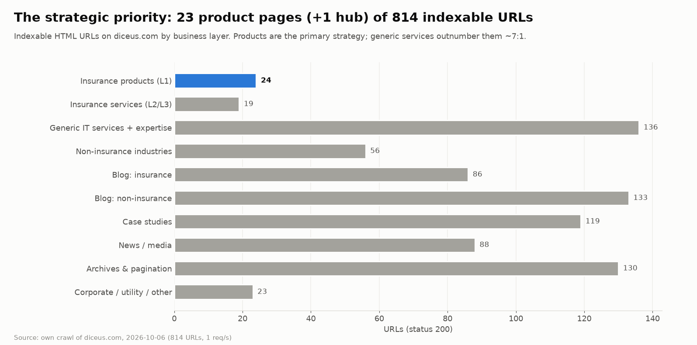
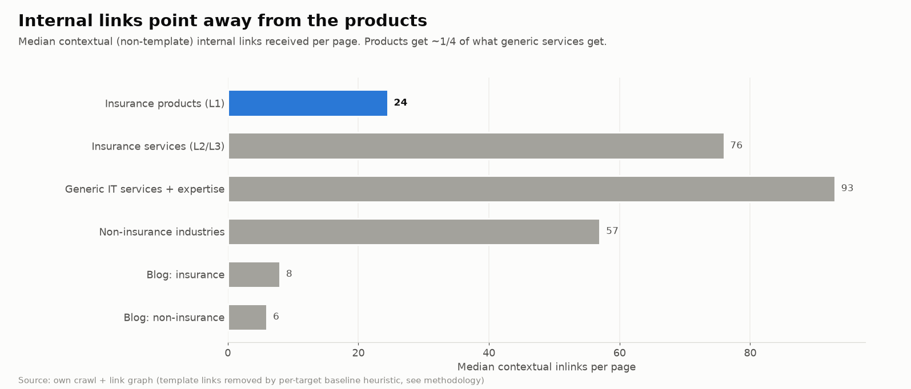
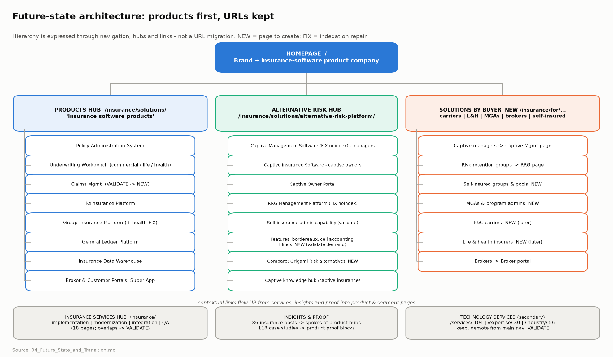
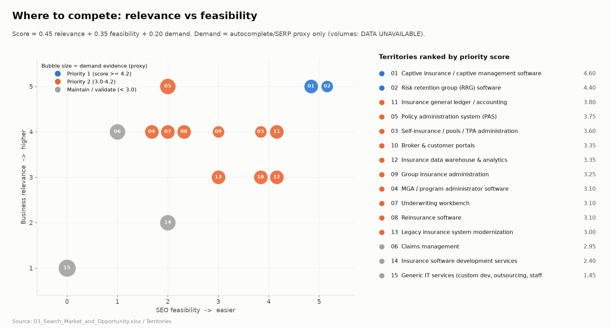
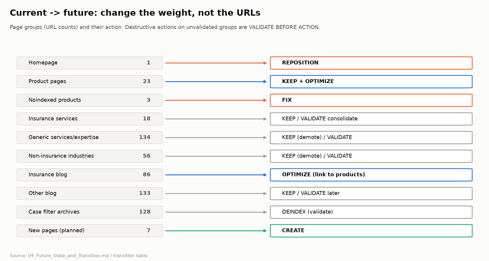
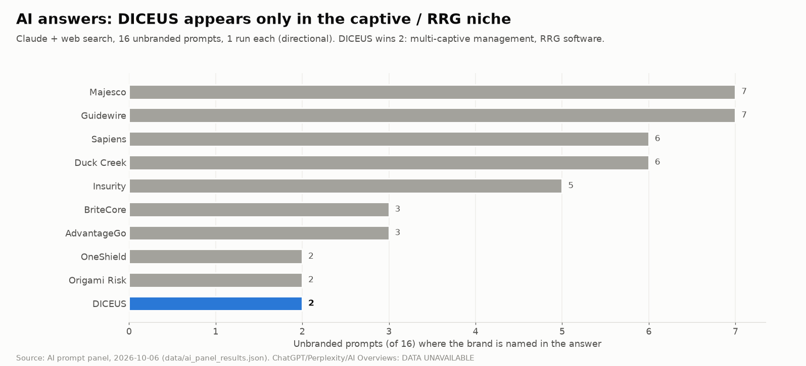

# 04 · Future State & Transition — diceus.com

*DICEUS · Senior Technical SEO & AI Search assignment · prepared 2026-10-06 · US English market*

> **How to read this document.** Every statement carries an evidence label: **FACT** (observed in our crawl, raw HTML, HTTP probe or recorded SERP/AI output), **INF** (inference), **HYP** (hypothesis), **REC** (recommendation), **DATA UNAVAILABLE**, **VALIDATION REQUIRED**. URL-level evidence lives in `02_Current_State_Audit.xlsx`, market evidence in `03_Search_Market_and_Opportunity.xlsx`.

---

## 1. The problem in one picture

- **FACT** The strategic priority (insurance software products) is **23 product pages, plus one products hub, out of 814** indexable URLs. Generic IT services, expertise and non-insurance industry pages total **~190** URLs.
- **FACT** The homepage title and H1 are *"Custom software development company"*. Its last `article:modified_time` is **2022-11-04**, which predates the product strategy.
- **FACT** Internal linking favours the secondary business. Product pages receive a median of **24** contextual (non-template) internal links. Insurance service pages receive **75** and generic service pages **93** (fig. 2).
- **FACT** Three product pages in `insurance-sitemap.xml` carry a second, hard-coded `<meta name="robots" content="noindex, nofollow">`:
  - Captive Management Platform
  - RRG Management Platform
  - Group Health

  Search engines apply the most restrictive directive.
- **FACT (lab, 1 run) / HYP (field).** The product page template is the slowest: captive page mobile LCP 12.2 s (vs 3.8 s home, 3.4 s generic service), because the Cookiebot consent text renders late and becomes the LCP element. Needs CrUX/RUM confirmation (plan W1-12).
- **FACT** Host and protocol hygiene is good: http→https and www→non-www are 301, and a random URL returns a real 404. Minor: `http://www.` takes 2 hops, and `/index.php` returns 200 with the homepage.
- **INF** The site is a services-company architecture with a product catalogue attached. Search engines and LLMs classify DICEUS accordingly. Our AI panel described its PAS pricing as the "$25–49/hr" Clutch development rate.

**Design principle that follows (REC):** *change the weight, not the URLs.* The hierarchy can be expressed through navigation, hubs, contextual links, titles and schema, at near-zero equity risk. URL migrations are reserved for cases where evidence shows the current URL is the problem. Today no such evidence exists (see §6, "Not yet").

---

## 1b. Benchmarks: competitors and companies that made the same pivot

**Same pivot, documented outcomes (FACT, public sources and Wayback; detail in `data/pivot_case_studies.md`):**

| Company | Move | Model | Lesson for DICEUS |
|---|---|---|---|
| Adacta → AdInsure | Sold its ~300-person services unit (2019); `adacta.si` 301 → `adacta-fintech.com` | Divest services | Full commitment was followed by analyst recognition and investment, but it took a corporate split |
| Decerto | Insurance products and software-house services on one domain, in separate Products and Services menus | **A: one domain, products first** | Closest analogue. Satellite `higson.io` without canonical splits authority, so avoid per-product domains |
| Mastek → Majesco | Demerger (2014); the 2016 nav still mixed dev/testing services; today no Services in the top nav | Demerger | Gartner MQ Leader (2025), 375+ customers (Feb 2026), acquired for ~$729M (2020) |
| Exigen → EIS | Services spun off, product renamed | Spin-off | One clear product identity for analysts |
| Stratoflow → Openkoda | New product domain; the dev shop stays as implementation partner | Separate brand | Works only for a new product with no search equity |
| Damco → InsureEdge | Product left under the Services menu | Anti-pattern | **This is DICEUS today** |

**Model choice (REC):** **Model A**, products first on `diceus.com`.
- **Why not a new domain:** diceus.com already holds #1 positions for captive and RRG software, and the Capterra, Gartner and Microsoft listings link to it. A new domain would reset that.
- **Generic services:** a *virtual spin-off*. They are demoted now and pruned or merged only when GSC and CRM show they earn nothing.
- **What we rejected and why:** the pivot agent recommended pruning the ~190 generic pages immediately. That would be a destructive action without evidence.

**Direct competitors: why DICEUS loses today (FACT, teardown of 13 vendors in `data/competitor_teardown.md`):**

| Gap | Best-in-class example | Fix |
|---|---|---|
| Identity: homepage sells custom development | Decerto, Luzern: category + outcome H1, segment self-select | Homepage per §4 |
| No alt-risk customer proof | Luzern: 4 anonymised testimonials plus quantified cases (~$55M premium). Riskonnect: named pool quote | W1-13 proof sprint |
| Proof is company-level (Gartner 5/5 and Clutch 4.9 measure services) | Socotra, hx: product metrics and product analyst badges | 10+ product reviews; product metrics |
| No security/trust page | Socotra `/security/` (ISO 27001, SOC 1 T2); hx shows SOC 2 + ISO on its homepage; Riskonnect has a Platform Security page (SOC 2 T2) | `/trust/` (W2-11) |
| No pricing model | Insly pricing tiers by segment (custom quotes); Luzern flat-rate model | `/pricing/` model page (W2-11) |
| No buyer assets | Riskonnect buying guide + RFP template; Luzern captive calculators | RFP template + RRG guide (W2-12) |
| Thin product template (no FAQ, video, integrations) | Riskonnect PAS, Vertafore MGA Systems | Template per Appendix A |
| No product schema; llms.txt = PAS only | Vertafore SoftwareApplication + FAQPage; Luzern and Decerto hand-written llms.txt | W1-10 |
| ~300-link mega-menu | Luzern ~8 nav links, Insly ~6 | Nav v2 (W2-03) |

**Whitespace (INF):**
- **Luzern Risk competes with DICEUS's buyers.** It is now an AI-native captive *manager* with $45M Series B funding. That makes "the software-only platform independent captive managers run on" a real wedge.
- **No vendor sells captive, RRG and self-insured as one product family.** Origami and Riskonnect never mention captives on their homepages, and Websure's captive page is ~250 words.
- **RRG search is almost uncontested.**
- **No authoritative "best captive management software" guide exists** (only directories and thin aggregator lists), and no captive software vendor has a curated llms.txt.

---

## 2. Future-state architecture

```mermaid
flowchart TD
  H["Homepage /<br/>brand + insurance-software product company"] --> P["Products hub<br/>/insurance/solutions/"]
  H --> AR["Alternative Risk hub<br/>/insurance/solutions/alternative-risk-platform/"]
  H --> SEG["Solutions by buyer<br/>/insurance/for/{segment}/ (NEW)"]
  P --> PAS[Policy Administration System]
  P --> UW["Underwriting Workbench x3"]
  P --> CL["Claims Mgmt (VALIDATE -> NEW)"]
  P --> RE[Reinsurance Platform]
  P --> GR["Group Insurance Platform (+health FIX)"]
  P --> GL[General Ledger Platform]
  P --> DWH[Insurance Data Warehouse]
  P --> POR["Broker / Customer portals, Super App"]
  AR --> CMP["Captive Management Software (FIX) - managers"]
  AR --> CIS["Captive Insurance Software - owners"]
  AR --> COP[Captive Owner Portal]
  AR --> RRG["RRG Platform (FIX)"]
  AR --> SI["Self-insured & pools (NEW, validate)"]
  AR --> CMPR["Origami Risk alternatives (NEW)"]
  AR --> KH["Captive knowledge hub /captive-insurance/"]
  SEG --> MGA["MGAs & program administrators (NEW)"]
  SEG --> SIG["Self-insured groups & pools (NEW)"]
  SVC["Insurance services hub /insurance/"] -.contextual links.-> P
  BLOG["86 insurance posts + 118 case studies"] -.contextual links.-> P
  BLOG -.-> AR
  TECH["Technology services: /services/ /expertise/ /industry/ (secondary)"] -.-> SVC
```

### 2.1 Layer roles and query ownership

| Layer | URL(s) | Role | Owns (query territory) | Must NOT target |
|---|---|---|---|---|
| **Homepage** | `/` | Brand entry; the "who is DICEUS" answer for search engines and LLMs | Brand navigational; *insurance software company / vendor*; *insurance software for carriers, MGAs and captives* | *custom software development company* (hand-off to `/services/custom-software-development/`) |
| **Products hub** | `/insurance/solutions/` | Product catalogue | *insurance software products / platform / solutions*; *insurance core system* | Individual product heads |
| **Product pages (L1)** | `/insurance/solutions/<product>/` | One product, one cluster | e.g. PAS: *policy administration system* + segment long-tail (*for MGAs / captives / RRGs*) | Services intent (*…development services*) |
| **Alternative Risk hub** | `/insurance/solutions/alternative-risk-platform/` | Strategic growth hub | *alternative risk platform / software*, *captive and RRG platform*, *self-insured fund software* | *captive management software* (child page owns it) |
| **Solutions by buyer (L2)** | `/insurance/for/<segment>/` (NEW) | Buyer-type pages, the winning SERP pattern for "X for Y" queries | *policy admin / underwriting software for MGAs*; *self-insurance administration software* | Product heads |
| **Insurance services (L3)** | `/insurance/` + `/insurance/<service>/` | Implementation, customisation, modernisation, integration, QA around products | *insurance software development / modernization / testing services* | Product terms (*policy administration system*) |
| **Technology services (L3, secondary)** | `/services/`, `/expertise/`, `/industry/` | Real but secondary revenue line | Existing generic service demand (unknown: DATA UNAVAILABLE) | Insurance product terms |
| **Insights & proof (L4)** | blog (root URLs), `/case-studies/`, `/media/` | Authority spokes linking up to owners | Informational / MOFU (*what is a captive*, *how to replace a legacy PAS*) | BOFU product terms (see captive blog example, Appendix A §11) |

### 2.2 Role of each business element

- **Products (primary).** These become the strongest-linked commercial pages: products-first navigation, contextual links from every relevant post and service, and `SoftwareApplication` schema.
  - One URL per sellable product. The **product truth table** (plan W1-06) decides which items are SKUs and which are modules. Example: Claims is today a PAS module with only a services page, so a claims product page is **VALIDATE BEFORE ACTION**.
- **Solutions / target markets.** These are buyer-type pages and do not duplicate products.
  - Evidence: competitors win *"for MGAs"* queries with dedicated segment pages (BriteCore `/why-britecore/for-mgas`, Insly, hx, Optalitix). DICEUS has none. **FACT, SERP sample.**
  - Where a product already *is* the segment answer, the product page serves the segment and no second page is created:
    - captive managers → Captive Management page
    - RRGs → RRG page
    - brokers → Broker portal
- **Services (secondary).** These stay live and indexable, are taken out of the primary product navigation, and are re-angled as *services around our products*.
  - Generic services are kept **as they are** until GSC/CRM show their value. They may be today's lead engine (**DATA UNAVAILABLE**).
- **Industries / verticals.**
  - Insurance segments become L2 buyer pages.
  - Non-insurance industries (banking, healthcare, retail, logistics, construction, finance; 56 URLs) remain secondary, are demoted from the primary nav, and are **VALIDATE BEFORE ACTION**.
- **Alternative Risk.** This is the first *fully built* product cluster: hub, six spokes, comparison page and knowledge hub. **INF** Of all territories it has the highest relevance × feasibility (§3). It is a sub-hub of Products, not a separate site: carriers remain core customers, and the hub cross-links to the PAS, GL and Reinsurance products it reuses.
- **Content / authority.** This is hub-and-spoke by territory. The 86 insurance posts keep their root-level URLs (no migration) and are *curated* into territory hubs through links. Topic gaps are filled where demand exists: captive accounting, domicile filings, RRG compliance, PAS replacement.

### 2.3 Internal-linking principles

1. **Links flow up.** Every insurance post, insurance service page and case study links to its **one owner** commercial page. It uses descriptive anchors: the product name plus a variant, not "learn more".
2. **Owners link sideways only within their family.** Captive pages link to the captive, RRG, owner-portal and GL pages, not to 12 random products (today's "related products" carousel).
3. **The template carries fewer links.** The mega-menu goes from ~300 links per page to ≤120. Products, Alternative Risk and buyer segments sit in the first menu columns. Generic services collapse into one "Technology services" entry plus its hub.
4. **Anchor ownership is consistent.** Each cluster's primary anchor points to its owner URL only. The ownership map (plan W1-07) is enforced by a weekly crawl check (06 §L).
5. **No internal links to redirects.** The legacy `/solutions/x` paths and the vitaminise URL are updated in place.

---

## 3. Where to compete (summary of 03)

| ID | Territory | Rel. | Demand (proxy) | Feas. | Score | Play |
|---|---|---|---|---|---|---|
| T01 | Captive insurance / captive management software | 5 | 3 | 5 | 4.6 | Defend & expand: fix noindex, split 'captive insurance software' (owners) vs 'captive management software' (managers), add proof |
| T02 | Risk retention group (RRG) software | 5 | 2 | 5 | 4.4 | Defend: fix noindex, add RRG-specific proof, compliance (NAIC/LRRA) content |
| T11 | Insurance general ledger / accounting | 4 | 3 | 4 | 3.8 | OPTIMIZE; tie into captive accounting cluster |
| T05 | Policy administration system (PAS) | 5 | 4 | 2 | 3.75 | Win long-tail ('PAS for captives / MGAs / RRGs', 'PAS modernization'), build reviews; head term = authority play, not 90-day target |
| T03 | Self-insurance / pools / TPA administration | 4 | 2 | 4 | 3.6 | CREATE segment page after product-capability validation |
| T10 | Broker & customer portals | 3 | 3 | 4 | 3.35 | OPTIMIZE + resolve portal overlap (VALIDATE) |
| T12 | Insurance data warehouse & analytics | 3 | 3 | 4 | 3.35 | KEEP/OPTIMIZE; avoid 'data model' head term |
| T09 | Group insurance administration | 4 | 2 | 3 | 3.25 | Fix noindex, OPTIMIZE parent page as owner of 'group insurance administration software' |
| T04 | MGA / program administrator software | 4 | 3 | 2 | 3.1 | CREATE 'for MGAs & program administrators' segment page; long-tail first |
| T07 | Underwriting workbench | 4 | 3 | 2 | 3.1 | OPTIMIZE existing 3 pages; MGA-underwriting long-tail |
| T08 | Reinsurance software | 4 | 3 | 2 | 3.1 | Long-tail: reinsurance data exchange, bordereaux, captive reinsurance; reviews |
| T13 | Legacy insurance system modernization | 3 | 3 | 3 | 3.0 | MOFU content hub feeding PAS |
| T06 | Claims management | 4 | 4 | 1 | 2.95 | VALIDATE product scope first; then product page + review-site inclusion rather than head-on ranking |
| T14 | Insurance software development services | 2 | 4 | 2 | 2.4 | KEEP & consolidate overlaps; not a growth bet |
| T15 | Generic IT services (custom dev, outsourcing, staff aug, AI dev) | 1 | 5 | 0 | 1.45 | VALIDATE BEFORE ACTION: keep, demote in nav, consolidate exact duplicates only after GSC |

**Demand vs relevance vs feasibility (as the brief requires).**
- The PAS and claims head terms have the most *demand* but low *feasibility*: Oracle, Guidewire, G2 and listicles own them (**FACT, SERP proxy**).
- Generic services have high *demand* but the lowest *relevance*.
- Captive and RRG have modest demand (**HYP**, volumes DATA UNAVAILABLE) but top *relevance* and *feasibility*. DICEUS is already #1 in the sample, and these are the only categories where it appears in AI answers.
- **INF** In a niche B2B market with ~6–8k captives worldwide and ~262 US RRGs, one closed captive-manager contract can outweigh thousands of informational visits. That is why demand carries the lowest weight in the score.

---

## 4. Homepage (assignment §4.4)

| | Current (FACT) | Future (REC) |
|---|---|---|
| Title | `DICEUS: Custom Software Development Company` | `DICEUS – Insurance Software for Carriers, MGAs & Captives` (≈57 chars) |
| H1 | `Custom software development company` | `Insurance software products for carriers, MGAs and alternative risk` |
| Meta description | "DICEUS #1 Custom software development company…" | Product-led; names the PAS, claims/underwriting, captive/RRG platforms, and proof |
| Hero | Two CTAs: "Explore services" first, "Discover solutions" second | Products first ("See the products" / "Book a demo"), with services as a secondary strip |
| Schema | Organization, LocalBusiness, FAQPage | `Organization` with `@id`, `description` ("insurance software vendor…"), `sameAs` (Clutch, Crunchbase, LinkedIn, G2, Gartner, Wikidata), `makesOffer` → products. Drop `LocalBusiness`: Delaware is a legal address, not a storefront |
| Last modified | 2022-11-04 | Rebuilt |

**Query territory to own:** brand navigational; *insurance software company / vendor / provider*; *insurance software for MGAs / captives* as an umbrella (product pages own the specifics).

**Conflict (FACT):** homepage title, H1 and URL tokens are 0.99-similar to `/services/custom-software-development/` (`Custom Software Development Company | DICEUS`). Two strong URLs compete for one generic query. The query is also the opposite of the strategy.

**Action (REC, staged, GSC-gated, high-risk change):**
1. **Gate (W1-01).** Export GSC queries for `/` (16 months).
   - If generic-development queries are a material share of non-brand clicks or leads (CRM), do step 2 first and wait 2–4 weeks.
   - If not, steps 2 and 3 can run together.
2. Make `/services/custom-software-development/` the explicit owner of generic-development intent. Strengthen its title and content, and point the services hub and all generic-dev anchors at it.
3. Retitle and rebuild the homepage (table above). Keep a services strip linking to the services hub so the secondary line stays discoverable.
4. Monitor daily for 14 days: brand and non-brand clicks to `/` and to the services owner. Keep a rollback snapshot.

**Interaction with other pages.**
- The homepage links to the products hub, the Alternative Risk hub, the top four products, buyer segments, proof and the services hub.
- `/insurance/` is repositioned as the **insurance services hub**. Today its title ("Insurance Software Development and Ready-Made Solutions") overlaps both the homepage and the products hub (**FACT** 191 contextual inlinks, second strongest page).

---

## 5. Current → Future transition (assignment §4.6)

Classification framework: **KEEP · GROW · OPTIMIZE · REPOSITION · CONSOLIDATE · REDIRECT · DEINDEX · REMOVE · CREATE · VALIDATE BEFORE ACTION**, plus **FIX** for indexation repairs, which are neither growth nor removal. Every URL also has a rule-based action and future role in `02_Current_State_Audit.xlsx › URL_Inventory`. The table below covers the *material* pages and groups.

| Page / group | Current URL(s) | Current role | Evidence | Future role | Action | Prio | Risk | Dependency | Validation required |
|---|---|---|---|---|---|---|---|---|---|
| Homepage | / | Services brand page: 'Custom software development company' (title+H1) | FACT title/H1; title sim 0.99 with /services/custom-software-development/; 298 contextual inlinks (top) | Brand + insurance-software product company entry; owns 'DICEUS', 'insurance software company/vendor' | REPOSITION (2-step) | P1 | High: may currently rank/convert for 'custom software development company' | GSC query export; leads by landing page (CRM) | GSC: queries & clicks to '/' last 16 months; if generic-dev queries > X% of non-brand clicks, move them to /services/custom-software-development/ FIRST, then retitle '/' |
| Products hub | /insurance/solutions/ | 'Ready-made Insurance Software Products' catalog, 951 words | FACT 107 contextual inlinks; no product schema | L1 Products hub: owns 'insurance software products/platform' | KEEP URL + GROW | P1 | Low | Nav redesign | None for URL; measure clicks/impressions after content expansion |
| Insurance hub | /insurance/ | Mixed: 'Insurance Software Development and Ready-Made Solutions' | FACT 191 contextual inlinks; mixes services and products -> overlaps homepage & products hub | Insurance technology SERVICES hub (implementation, modernization, integration, data, QA, support) | REPOSITION | P2 | Medium: strong internal authority; queries unknown | Homepage repositioning | GSC: which queries '/insurance/' gets; keep any product-intent queries routed to /insurance/solutions/ |
| Alt-risk hub | /insurance/solutions/alternative-risk-platform/ | New (2026) AROP product page | FACT #1 'alternative risk management software' (ambiguous intent); 24 contextual inlinks | Alternative Risk HUB: links captive, RRG, self-insured, MGA/program segments + features | GROW | P1 | Low | Product marketing input | Track impressions for alt-risk cluster in GSC |
| Captive mgmt platform | /insurance/solutions/captive-insurance/captive-management-platform/ | Product page, NOINDEXED | FACT 2nd robots meta = noindex,nofollow; in sitemap; won AI prompt #2 | Owner of 'captive management software' (captive MANAGERS, multi-captive ops) | FIX + OPTIMIZE (page spec, Appendix A) | P0 | Low (restoring) | Dev access to template | URL Inspection after fix; confirm indexed within 14 days |
| Captive insurance software | /insurance/solutions/captive-insurance/captive-insurance-software/ | Product page; #1 'captive insurance software' | FACT #1 + #3 in SERP sample; 27 contextual inlinks | Owner of 'captive insurance software' (captive OWNERS / insurers: policy, billing, claims) | KEEP + OPTIMIZE | P1 | Medium: current #1 - avoid changing title/URL abruptly | Query split with O03 | GSC: confirm the two captive URLs don't swap rankings after split |
| Captive parent | /insurance/solutions/captive-insurance/ | 'Captive Insurance Company: Examples, Benefits, and Software' (informational, 964 words) | FACT 0 contextual inlinks (weakest product-tree page); mixed intent | Captive insurance knowledge hub (TOFU/MOFU) feeding 3 captive products | VALIDATE BEFORE ACTION -> REPOSITION | P2 | Medium: may rank for informational captive queries | GSC | GSC queries; if informational, keep URL and become knowledge hub; else merge into AROP hub (301) |
| Captive owner portal | /insurance/solutions/captive-insurance/captive-owner-portal/ | Product page | FACT 'captive owner portal' SERP = Wi-Fi captive portals (off-intent) | Child product; target 'captive owner reporting portal' variants | OPTIMIZE | P2 | Low | - | Track branded + long-tail |
| RRG platform | /insurance/solutions/risk-retention-group-management-platform/ | Product page, NOINDEXED | FACT noindex,nofollow 2nd meta; #1 in SERP sample; won AI prompt #3 | Owner of 'risk retention group software' | FIX + OPTIMIZE | P0 | Low | Dev | URL Inspection; index within 14 days |
| Core products | PAS, UW (3), Reinsurance, Group (3), GL, DWH, Broker portal, Customer portal, Super app (4), Chatbot | Product pages (23 total) | FACT 0/23 with product schema; median 24 contextual inlinks | L1 product pages, one URL per product, each owning one query cluster | KEEP + OPTIMIZE | P1 | Low | Product data (features, integrations, proof) | Per-page GSC baseline before edits |
| Group health | /insurance/solutions/group-insurance-management-platform/health/ | Product sub-page, NOINDEXED | FACT noindex,nofollow | Child of group platform | FIX (or intentionally noindex + remove from sitemap) | P0 | Low | Confirm with product team if noindex intended | Ask owner; then fix |
| Claims product (gap) | (none) - only /insurance/claims-management-development/ (service) | Gap | FACT no claims product page; brief lists Claims as product territory | L1 Claims Management product page | VALIDATE BEFORE ACTION -> CREATE | P2 | Medium: creating a 'product' page for a module could mislead buyers | Product team: is claims sold standalone? | Product confirmation + demand check (Ahrefs/GSC) |
| Segment pages (gap) | (none) | Gap | SERP: segment pages win 'for MGAs' etc. | L2 Solutions by buyer: self-insured & pools, MGAs/program admins, P&C carriers, L&H insurers (captive managers, RRGs, brokers are served by their product pages) | CREATE | P1 (alt-risk) / P2 (others) | Low | Messaging per ICP | Indexed + ranking top-20 for target cluster within 90 days |
| Insurance services | /insurance/<service>/ (18 pages) | Insurance software DEVELOPMENT services ('Custom ... Software Development') | FACT median 75 contextual inlinks (3x products); overlap pairs (policy-admin vs policy-mgmt 0.59, claims vs health-claims 0.77, portal vs customer-portal 0.76) | L3 services around products (implementation, customization, integration, migration) | KEEP + OPTIMIZE; overlaps = VALIDATE -> CONSOLIDATE | P2 | Medium | GSC per-URL | GSC: query overlap per pair; consolidate only where both URLs rank for same queries |
| Generic services | /services/* (104) | Generic outsourcing services | FACT 104 URLs; median 93 contextual inlinks; no evidence of traffic (DATA UNAVAILABLE) | L3 'Technology services' - secondary, out of primary product nav | KEEP (demote) / VALIDATE BEFORE ACTION | P3 | High if pruned blindly: may be the current lead engine | GSC + GA4 + CRM | Traffic + leads per URL (12 months); prune only URLs with 0 clicks, 0 links, 0 leads |
| Generic service duplicates | mvp-development(-services), vendor-portal-(software\|development), software-support x3, it-(service-)management-consulting | Exact/near-exact duplicates | FACT title similarity 0.89-1.00 | One URL per intent | CONSOLIDATE (301) after validation | P3 | Medium | GSC + backlinks | Pick survivor by clicks + referring domains |
| Expertise | /expertise/* (30) | Tech-capability services (AI, BI, cloud, data) | FACT AI cluster has 6+ overlapping pages (generative AI consulting vs development 0.68) | L3 services; AI pages re-angled to 'AI for insurance' where possible | KEEP / VALIDATE | P3 | Medium | GSC | Per-URL clicks |
| Non-insurance industries | /industry/* (56: banking, finance, healthcare, retail, logistics, construction) | Vertical services | FACT 56 URLs, no insurance relevance | Secondary; out of primary nav | KEEP (demote) / VALIDATE BEFORE ACTION | P3 | High if removed: unknown traffic/leads | GSC + CRM | Same rule as generic services |
| Insurance blog | 86 insurance-relevant posts (root-level URLs) | Authority content, weakly linked to products | FACT 86/219 posts insurance-relevant; median 7 contextual inlinks per post | L4 authority clusters linked to product hubs (hub-and-spoke by territory) | KEEP + OPTIMIZE (links, refresh) | P1 | Low | Topic->product map | Contextual links added; GSC impressions trend |
| Generic blog | ~133 non-insurance posts | Generic dev/outsourcing content | FACT 133 posts; median 3,000 words | Supports services; not product authority | KEEP / VALIDATE (prune later) | LATER | Medium | GSC | Prune only 0-click, 0-link posts after 12-month review |
| Vacancy posts | ~10 job posts in post-sitemap | Careers | FACT | Careers section; expire properly | REPOSITION / 410 when closed | P3 | Low | - | - |
| Case studies | /case-studies/* (118) | Proof | FACT 118 cases; few US/alt-risk | Proof layer linked from product pages by product/segment | KEEP + OPTIMIZE | P2 | Low | Case->product tagging | - |
| Case filter archives | /case-studies/(service\|industry\|expertise\|country)/... (~128) | Thin templated archives | FACT ~220 words; 106 not in sitemap; 6 country archives have zero inlinks | Utility navigation | DEINDEX (noindex,follow) - VALIDATE first | LATER | Low | GSC | Confirm zero organic entrances |
| Media / news | /media/* (97) | Company news | FACT VCIA, MS Marketplace, InsureMO news = entity evidence | PR/entity proof; link from relevant products | KEEP | P3 | Low | - | - |
| Legacy URLs | Wayback-only URLs (785 historical paths not in sitemap) | Past migrations (/industry/insurance/* -> /insurance/*, vitaminise rename) | See 02/Legacy_Redirects | 301 to closest live equivalent | REDIRECT (fix chains/404 with equity) | P2 | Low | Backlink data | Check referring domains (Ahrefs/GSC links) before choosing targets |
| Danish /da/ | /da/ (4 pages) | Localized stubs | FACT 4 pages; hreflang only x-default | Nordic market support | VALIDATE BEFORE ACTION | LATER | Low | Nordic marketing | Decide DA strategy; add reciprocal hreflang if kept |

**Equity-protection rules applied to every destructive action (REC):**
1. No redirect, consolidation or deindex without a GSC baseline for the URL (clicks, impressions, queries) and referring-domain data. Today both are **DATA UNAVAILABLE**, so most such actions are VALIDATE BEFORE ACTION.
2. Redirects resolve in one hop to the closest equivalent, never to the homepage.
3. A change log records URL, action, date, owner, baseline and a 14/28-day review.
4. Retitles of currently ranking pages (e.g. `captive-insurance-software`, #1 in the sample) change wording **additively**: the existing primary term is kept.

### 5.1 Legacy URLs from past migrations (FACT)

Wayback CDX returned 2,098 historical HTML URLs (1,475 clean paths); **785** are not in today's sitemaps. We re-checked **195** of them hop-by-hop: all insurance-related and section paths, plus deterministic samples of case studies and root-level posts.

| Group | Checked | Final 200 | Final 404 | Final 410 | Chains (≥2 hops) |
|---|---|---|---|---|---|
| case | 30 | 29 | 1 | 0 | 0 |
| insurance | 58 | 48 | 6 | 4 | 5 |
| root_post | 90 | 47 | 23 | 20 | 5 |
| section | 17 | 4 | 13 | 0 | 0 |

**FACT — legacy insurance/section URLs that now end in 404/410 (equity-loss candidates; prioritise by referring domains, DATA UNAVAILABLE):**

| Legacy path | First seen (Wayback) | Chain |
|---|---|---|
| /case-studies/all-in-one-insurance-management-system/ | 20200804 | 404 |
| /custom-life-insurance-crm-software/ | 20190718 | 410 |
| /data-researcher-insurance-tech/ | 20260705 | 404 |
| /insurance-business-consultant/ | 20220807 | 404 |
| /insurance-development-insights-on-the-industry-and-software/ | 20200924 | 410 |
| /insurance-software-houses/ | 20200804 | 410 |
| /insurance-software-vendors/ | 20200926 | 410 |
| /outbound-research-data-specialist-insurance-tech/ | 20260518 | 301>404 |
| /senior-java-developer-insurance/ | 20220807 | 404 |
| /senior-project-manager-insurance-part-time/ | 20260612 | 404 |
| /company/about/ | 20130115 | 301>404 |
| /company/about-team/ | 20130115 | 301>404 |
| /company/career/ | 20130115 | 301>404 |
| /company/discover-ukraine/ | 20130115 | 301>404 |
| /company/our-approach/ | 20130115 | 301>404 |
| /services/2d-graphics/ | 20130115 | 404 |
| /services/java-development/ | 20130115 | 404 |
| /services/mobile-development/ | 20130115 | 404 |
| /services/net-development/ | 20130115 | 404 |
| /services/solutions-testing/ | 20130115 | 404 |
| /services/web-development/ | 20130115 | 404 |
| /solutions/services/net-development/ | 20120504 | 301>404 |
| /solutions/services/web-development/ | 20120504 | 301>404 |

**INF:** the `/industry/insurance/*` → `/insurance/*` migration and the 'vitaminise' rename were mostly redirected (48 of 58 insurance legacy URLs resolve to a 200). REC: fix 404s that have backlinks, collapse chains to one hop (plan W1-05). Full list: 02 › Legacy_Redirects.

---

## 6. What we deliberately do not do yet

**1. Prune / noindex / redirect the ~190 generic service, expertise and non-insurance industry pages**

- *Unknown:* Their organic clicks, rankings, backlinks and lead contribution (DATA UNAVAILABLE: no GSC, GA4, CRM).
- *Why acting now is risky:* They may be today's main lead engine; services are 'commercially useful and real'. Blind pruning could destroy revenue and link equity.
- *Evidence needed first:* 12-16 months GSC clicks/impressions per URL, GA4 conversions, CRM lead source by landing page, referring domains per URL.

**2. Migrate product URLs to a new /products/ folder (or rename /insurance/solutions/)**

- *Unknown:* Backlinks and directory/marketplace links per product URL; whether the folder name has any measurable ranking effect.
- *Why acting now is risky:* URL migration resets signals and risks equity loss (the site already shows legacy-migration debris); the hierarchy goal is achievable via nav, hubs and links.
- *Evidence needed first:* Referring-domain data per URL (Ahrefs/GSC links), GSC performance baseline; evidence that the current path hurts CTR or understanding.

**3. Merge the two captive product pages (captive-insurance-software vs captive-management-platform) or the overlapping insurance-service pairs**

- *Unknown:* Which URL Google prefers per query, whether both rank for the same queries, and whether they are distinct SKUs.
- *Why acting now is risky:* One of them is currently #1; consolidating the wrong way could lose the best position in the strategic niche.
- *Evidence needed first:* GSC query-by-page report (cannibalization check), product team confirmation of SKU boundaries, 4-6 weeks of post-split data.

---

## 7. AI Search / GEO (assignment §4.7)

**What we measured (FACT, Claude + web search, 20 prompts, 1 run each, 2026-10-06):**
- **Mentions.** DICEUS is named in **2 of 16** unbranded prompts (multi-captive management, RRG software), first both times, with diceus.com as the top citation. It is named in **0 of 11** broader categories (PAS, claims, underwriting, reinsurance, group, GL, DWH, modernization, custom development).
- **Who wins share of voice.** Guidewire (7), Majesco (7), Sapiens (6), Duck Creek (6) and Insurity (5) lead. Broad answers are assembled from **analyst lists** (Celent, Datos), **G2/Capterra category and "alternatives" pages** and **listicles**. DICEUS is in none of these.
- **Branded failure.** *"What is DICEUS?"* resolved to DICE acronyms and a game, "Dicedus". There is no Wikipedia or Wikidata entity.
- **Lost attribution.** DICEUS listings surfaced, but under generic names ("Captive Management Platform") with **0 reviews**, so the brand was dropped from the answer.
- **Fragile wins.** The pages that won are among the **noindexed** ones. Claude's index still had them; Google and Bing honour noindex.
- **Readiness.** AI crawlers (GPTBot, ClaudeBot, PerplexityBot, CCBot) get HTTP 200, and pages are server-rendered. `llms.txt` exists but lists only the PAS. **FACT:** 0 of 23 product pages have product schema.

**What can and cannot be measured reliably today:**

| Measurable reliably | Measurable with noise | Not measurable (today) |
|---|---|---|
| Crawler access (logs, robots); indexation (GSC); schema validity; whether a listing or review exists; referral sessions from chatgpt.com / perplexity.ai in GA4 | Mention and citation share in a fixed prompt panel (non-deterministic: use ≥3 runs per prompt × engine and track trends); Google AI Overviews presence (third-party trackers, sampling) | True "impressions" inside LLM answers; personalised or logged-in answers; how much training-data exposure (vs retrieval) drives mentions; AI Mode clicks split out in GSC (only partially) |

**Experiment design (REC):**
- **Panel.** 40 prompts in 4 groups (captive/RRG, core products, vendor comparison, branded). Run 3 times on each of Claude, ChatGPT, Perplexity and Google AI Overviews/AI Mode, monthly.
- **Interventions.** Tag each with a date:
  - noindex fix
  - schema
  - branded listings
  - Wikidata
  - comparison page
  - reviews
- **Readout.** Difference-in-differences against control prompts the interventions don't touch, e.g. PAS head terms, where no work is planned for 60 days.
- **Success.** Claude unbranded share of voice ≥5/16 in 90 days. The branded entity answer is correct on at least 3 of 4 engines.

**Source opportunities (ranked by observed citation frequency):**
1. Product directories under the brand name, with reviews
2. G2 category and "alternatives" pages
3. Celent VendorMatch / Datos Market Navigator
4. Captive trade press (Captive Review, Captive International, Captive.com, which already covered DICEUS in Sep 2026)
5. Insurance-Canada / Coverager-style customer-win news
6. DICEUS's own comparison page (Origami Risk alternatives), since prompt #19 found no comparison page anywhere

---

## Appendix A — Production-ready page specification

### Captive Management Software (for captive managers)

**URL (unchanged):** `https://diceus.com/insurance/solutions/captive-insurance/captive-management-platform/`

#### A1. Why this page
- **FACT.** The page sits in the top-priority territory (score 4.6), and alternative risk is the brief's named growth area.
- **FACT.** It is currently **noindexed** by a stray tag, even though it is in the sitemap and won AI prompt #2. That is the single biggest lift for the least effort.
- **FACT.** The SERP for *"captive management software"* shows **no DICEUS vendor page**: only a directory listing and trade press. *"captive insurance management system"* is held by captive managers' own technology pages (Marsh, Aon) and Origami Risk. No SEO-optimised vendor page dominates.
- **INF.** The VCIA partnership (Jun 2026, 400+ members) gives a credible, timely proof point and a distribution channel.

#### A2. Page role
L1 product page and the **segment entry point for captive managers**. No separate "for captive managers" page is created, to avoid self-cannibalisation. It is a spoke of the Alternative Risk hub.

#### A3. Audience / ICP
- **Primary.** US captive managers (independent and broker-owned) that administer roughly 10–200 captives across domiciles (Vermont, Utah, Delaware, North Carolina, South Carolina, Tennessee, plus offshore). Roles: captive manager or director of captive services, controller or CFO, operations lead.
- **Secondary.** Protected-cell / PCC administrators, RRG managers (link to the RRG page), and captive owners' risk managers (link to the Owner Portal).
- **Jobs to be done:**
  - getting off spreadsheets
  - multi-entity and cell accounting
  - bordereaux reconciliation
  - domicile filing calendars
  - owner and participant statements
  - audit trail

  (INF, from VCIA/trade press and DICEUS's own AROP messaging)

#### A4. Search intent
BOFU commercial investigation: building a vendor shortlist. Secondary MOFU: *"how do captive managers manage multiple captives"* (answered on-page, with depth in the blog).

#### A5. Query clusters

| Cluster | Queries (Autocomplete-observed or variant) | Role on page |
|---|---|---|
| Primary | captive management software · captive management system · captive insurance management software / system · software for captive managers | Title, H1, intro, H2 "Run every captive…" |
| Secondary – operations | multi-captive management · cell captive / PCC administration software · captive accounting software · captive reporting software | H3 sections, FAQ |
| Secondary – compliance | captive regulatory filing · captive statutory reporting · domicile compliance calendar | H3 + FAQ |
| Secondary – data | bordereaux management for captives · loss runs · premium & claims bordereaux reconciliation | H3 |
| Excluded (owned elsewhere) | captive insurance software (→ `captive-insurance-software`, #1 today) · captive owner portal (→ owner portal; SERP is Wi-Fi portals) · risk retention group software (→ RRG page) · alternative risk platform (→ AROP hub) | Linked, not targeted |

Volumes: **DATA UNAVAILABLE**. Validate with Ahrefs/Semrush and the GSC baseline once the page is indexed.

#### A6. SERP & competitor observations (FACT, SERP proxy, 2026-10-06)
- **"captive management software":** DICEUS appears only as a GetApp listing (0 reviews) alongside trade press. There is no strong vendor page.
- **"captive insurance management system":** Marsh, Aon (captive managers' proprietary technology) and Origami Risk.
- **Listicle gitnux "Top 10 captive insurance software":** lists Sapiens, Origami Risk, Guidewire, Sovos, OneShield, Majesco, A1 Tracker, Insurity, InsCipher and Marsh. DICEUS is absent.
- **What competitors do well:**
  - Origami addresses risk pools and TPAs on industry pages.
  - Insurity and Duck Creek back pages with named customers, counts and analyst badges.
  - Insly shows an **implementation timeline with durations**.
- **What DICEUS's current page lacks:** a captive-specific customer or metric, pricing-model language, domicile specifics, and a clean answer-first summary.

#### A7. Title, H1, meta
- **Title:** `Captive Management Software for Captive Managers | DICEUS` (≈57 chars)
- **H1:** `Captive management software for multi-captive operations`
- **Meta description (≈150):** `Run every captive, cell and RRG from one platform: multi-entity ledger, bordereaux, domicile filings and owner reporting. VCIA technology partner. Book a demo.`

#### A8. Structure & H2/H3 outline
1. **Hero.** One-sentence answer-first definition: "*DICEUS Captive Management Platform is captive management software that lets captive managers…*". It carries three proof chips (VCIA technology partner · Microsoft Marketplace vendor · ISO 9001) and two CTAs: **Book a demo** and **Watch the 3-minute walkthrough**.
2. **H2 Who it's for.** Captive managers · PCC/cell administrators · RRG managers → RRG page · self-insured groups → segment page.
3. **H2 Run every captive from one platform.**
   - H3 Multi-captive and protected-cell structure
   - H3 Policies, premium and billing
   - H3 Claims and loss runs
   - H3 Reinsurance and fronting arrangements
   - H3 Multi-entity general ledger and owner statements → GL Platform
   - H3 Bordereaux ingestion and reconciliation
   - H3 Statutory and domicile filing calendar
   - H3 Documents, workflow and audit trail
4. **H2 How it works.** Architecture (MACH/API), low-code configuration, integrations (accounting/ERP, DocuSign/RSign, CRM, data warehouse), hosting and security.
5. **H2 Implementation in weeks, not years.** Phased timeline with durations; migration from spreadsheets or legacy systems → insurance services (migration).
6. **H2 Results / proof.** A named customer or quote with one metric (*required*). The VCIA partnership. The Captive.com article.
7. **H2 How it compares.** Versus spreadsheets plus generic accounting, and versus broad RMIS suites, in a fair, factual table → *Origami Risk alternatives* page.
8. **H2 Pricing model.** Subscription or licence, and what drives price (entities, modules, users). No number is needed, but this stops LLMs from quoting the $25–49/hr services rate.
9. **H2 FAQ** (6–8 visible Q&As):
   - What is captive management software?
   - Can it handle protected cell companies?
   - Which domiciles' filings does it track?
   - Does it replace our general ledger?
   - How long does implementation take?
   - How is data migrated from spreadsheets?
   - What security certifications do you have? (answer only with facts)
10. **H2 Related products.** Captive Insurance Software (for captive owners) · Captive Owner Portal · RRG Platform · Alternative Risk Platform · General Ledger Platform.
11. **Final CTA.**

#### A9. Content requirements
- 1,800–2,500 visible words, server-rendered. No tabs that hide primary text from the initial HTML.
- An answer-first paragraph of ≤60 words directly under the H1, for extraction by AI answers and snippets.
- Lists and tables for facts (entity types, domiciles, integrations), because LLMs and snippets lift structured facts.
- 4–6 real UI screenshots with descriptive alt text, plus a 2–3 minute walkthrough video.
- A named author or reviewer with captive expertise in the byline and sidebar (E-E-A-T). Last-reviewed date shown.

#### A10. Product / business information required from DICEUS (blocking)
1. A confirmed module list and what is live versus roadmap. Roadmap items are excluded or labelled.
2. Supported entity types (pure, group, PCC/cell, RRG, reciprocal) and domicile coverage.
3. Integrations that actually exist.
4. Deployment model and security certifications. ISO 27001 and SOC 2 are **not verified** publicly, so they must not be claimed without proof.
5. Implementation durations from real projects.
6. Pricing model.
7. **At least one referenceable customer** (quote, logo or metric). If none exists yet, use the VCIA partnership and pilot data, and mark the gap in the backlog.

#### A11. Proof / trust requirements
- Named customer proof (the gap today).
- The VCIA partnership, with a link to VCIA and the DICEUS news post.
- Gartner Peer Insights **only once** the captive product has reviews. Today it shows "no reviews yet", so the page must not imply ratings that belong to other products.
- Security or certification badges that are verified.
- The Captive.com coverage (Sep 2026).

#### A12. Internal links
- **In (≥15, contextual, descriptive anchors):**
  - Alternative Risk hub (primary)
  - Homepage (alternative-risk band)
  - Products hub
  - `captive-insurance-software` and `captive-owner-portal`
  - RRG page
  - GL Platform
  - `/insurance/solutions/captive-insurance/` (knowledge hub)
  - blog posts: `/why-captive-managers-are-moving-away-from-spreadsheets/`, `/how-technology-transforms-captive-insurance-management/`, `/building-technology-ready-captive-ecosystem/`, `/webinar-automating-financial-operations-alternative-risk/`
  - news: `/media/diceus-joins-vcia-as-a-technology-partner/`, `/media/diceus-at-european-captive-forum/`, `/media/diceus-attended-airmic-captives-forum-london/`
  - the Origami Risk alternatives page
  - the self-insured segment page
- **Out:** the related products in A8 §10; insurance services (migration, implementation); the case study; the demo/contact page.

#### A13. Schema
- `SoftwareApplication` with `@id`:
  - `name: "DICEUS Captive Management Platform"`
  - `applicationCategory: "BusinessApplication"`
  - `operatingSystem: "Web"`
  - `publisher` → Organization `@id`
  - `featureList`
  - `offers` **only** if the pricing model is published
  - `aggregateRating` **only** from genuine on-platform reviews
- `BreadcrumbList`, `FAQPage` (matching the visible FAQ), `VideoObject` (walkthrough).
- *Note:* Google shows FAQ rich results only for a narrow set of sites. FAQ markup is used here for semantic clarity and AI extraction, not SERP features.

#### A14. Cannibalisation considerations
- **vs `captive-insurance-software`** (#1 for *captive insurance software*). Separate by **audience**: managers vs owners/insurers. Neither title uses the other's head term. Monitor for ranking swaps in GSC for 6 weeks.
- **vs blog `/why-captive-managers-are-moving-away-from-spreadsheets/`.** Its title is "*Captive Management Software: Stop Using Spreadsheets*" (**FACT**), which targets the same head term. Re-angle it to an informational title ("Why captive managers are moving away from spreadsheets") with a prominent link to this page. **VALIDATE** first with GSC (it may currently rank).
- **vs AROP hub.** The hub owns *alternative risk platform*; this page owns *captive management software*.
- **vs `/insurance/solutions/captive-insurance/`.** That page becomes the informational knowledge hub (VALIDATE).

#### A15. AI-search considerations
- Use the brand in the product name everywhere: page, schema and **all directory listings** ("DICEUS Captive Management Platform"). This fixes the lost attribution in prompt #1.
- Give an answer-first definition, factual lists, and pricing-model language (fixes the mis-pricing in prompt #18).
- Publish a `.md` copy and list it in `llms.txt`.
- Link a fair comparison page (prompt #19 found none).
- Cite third-party proof (VCIA, Captive.com).

#### A16. Acceptance criteria / Definition of Done
- [ ] Raw HTML has **exactly one** robots meta and no `noindex`. Self-canonical. In the sitemap. GSC URL Inspection says "URL is on Google" within 14 days.
- [ ] Title, H1 and meta exactly as specified (±5 chars for copy edits). One H1.
- [ ] All H2 sections in A8 are present. The answer-first paragraph is ≤60 words. 1,800–2,500 visible words, server-rendered.
- [ ] At least one named proof item. No unverified certification or rating claims (SME and legal sign-off).
- [ ] FAQ visible and matched by `FAQPage`. `SoftwareApplication` and `BreadcrumbList` validate with 0 errors in the Rich Results Test and Schema.org validator.
- [ ] ≥15 contextual internal links in, from the sources listed in A12 (verified by crawl). 0 internal links to redirects.
- [ ] Mobile LCP < 2.5 s and CLS < 0.1 (CrUX if available, otherwise PSI lab median of 3 runs).
- [ ] Demo-form and video-play GA4 events are firing. CRM lead source captures the landing page.
- [ ] `.md` version listed in `llms.txt`. All directory listings renamed to "DICEUS Captive Management Platform" and linking to this URL.
- [ ] 28-day review: impressions for the primary cluster are above baseline, and there is no ranking loss for `captive-insurance-software` on *captive insurance software*.
