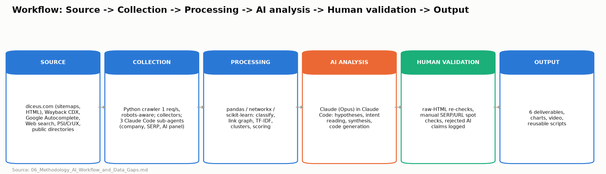

# 06 · Methodology, AI Workflow & Data Gaps

*How the work was actually done. Everything below is reproducible from `/scripts` and `/data` in the submission folder.*



---

## A. Work sequence

| Step | What I did | Hypothesis at that moment | What changed |
|---|---|---|---|
| 1 | Read the brief; extracted the business hierarchy (Products > Solutions > Services > Content) and the 4.x requirements into a checklist | "The site is still architected as a services company" | Confirmed in step 2 within minutes |
| 2 | Pulled `robots.txt` and the Yoast sitemap index (10 child sitemaps, **709 URLs**); listed URL paths per sitemap | Products are buried | **FACT:** only 45 `/insurance/*` URLs vs 105 `/services/`, 56 `/industry/`, 31 `/expertise/` |
| 3 | In parallel: launched 3 Claude Code sub-agents (company research, SERP/competitors, AI-search panel), and wrote and ran a polite crawler | Alternative risk may be a real wedge; the AI footprint is probably weak | The research agent found the 2026 US pivot (VCIA, AROP page); the SERP agent found DICEUS **#1** on captive/RRG; the AI agent found DICEUS named only in captive/RRG prompts |
| 4 | **AI agent reported `noindex` on the captive and RRG product pages.** My crawler said they were indexable | Either the agent or my crawler is wrong | Raw-HTML check: the pages have **two** robots metas, the second `noindex, nofollow`. My crawler read only the first → bug fixed; a head re-check of all 815 URLs found exactly 3 noindex pages |
| 5 | Ran the scalable analysis (classification, link graph, TF-IDF, title-intent similarity) | Products are under-linked | First run showed 0 contextual links for every product → suspicious → found a 2nd crawler bug (nav flag by URL, not element) → per-target template-baseline heuristic → validated manually on 2 pages (20/21 and 12/13 link targets matched) |
| 6 | Body-text TF-IDF found few duplicates among money pages | Cannibalization is lower than expected | Switched to **title/H1/URL similarity** (intent, not text) → 34 overlap pairs, incl. **homepage vs /services/custom-software-development/ = 0.99** |
| 6b | PSI quota exhausted → local Lighthouse on 3 templates | Templates perform similarly | **Product template slowest** (captive page lab LCP 12.2 s; LCP element = Cookiebot consent text). Logged as HYP pending field data |
| 7 | Wayback CDX (2,098 historical URLs → 785 paths not in today's sitemap) → hop-by-hop legacy check | Past migrations may have leaked equity | See 04 §5.1 |
| 8 | Autocomplete keyword discovery (699 suggestions → 513 relevant → 23 clusters), merged with SERP sample → territory scoring | PAS is the biggest prize | Re-ranked: PAS has the most demand but is the least feasible; captive/RRG come out on top on relevance × feasibility |
| 9 | Designed the architecture, transition, spec and plan from a single data module (`strategy_data.py`) so all 6 deliverables agree | A separate "for captive managers" segment page | **Rejected** in self-review: it would cannibalize the captive product page (see H) |
| 10 | Built Excel, Markdown, charts and video from scripts; cross-checked every number in 01/04 against the Excel sheets | — | AI share-of-voice recount corrected (Guidewire 8 → 7) |

## B. Tools used

| Tool | Purpose | Data produced | Why chosen | Alternative considered |
|---|---|---|---|---|
| **Python crawler** (`requests` + `BeautifulSoup/lxml`, own code) | Full-site crawl, link graph, on-page data | `crawl.jsonl` (815 URLs), `pages_text/` | Full control of politeness, redirect hops and the fields we need; reproducible; free | Screaming Frog (free tier caps at 500 URLs, which is < site size); Sitebulb (paid) |
| **pandas / networkx / scikit-learn** | Classification, PageRank, TF-IDF similarity, rollups | `urls_analyzed.csv`, overlap CSVs | Scales to the full dataset; transparent rules | Spreadsheet formulas (not reproducible at 800 URLs × 300 links) |
| **Wayback Machine CDX API** | Historical URL inventory (equity-loss check) | `wayback_urls.json`, `legacy_redirects.csv` | Only free source of the past URL set without GSC | Ahrefs "best by links / lost pages" (no access) |
| **Google Autocomplete** (public suggest endpoint, 1 req/1.2 s) | Keyword universe discovery | `autocomplete.json`, `keywords.csv`, `clusters.csv` | Real US user queries, free. Proves existence, not volume | Google Keyword Planner (needs an ads account, gives bucketed volumes), Ahrefs/Semrush (no access) |
| **Claude Code WebSearch / WebFetch** (via sub-agents) | SERP sampling (44 queries), competitor page structure (8 fetches), company research, AI-answer panel | `serp_observations.json`, `serp_competitors.md`, `research_company.md`, `ai_panel_results.json` | Available without purchase; the same tool doubles as the "Claude with web search" engine being measured | DataForSEO/SerpAPI (paid; best for real Google US SERPs at scale) |
| **PageSpeed Insights API v5** (no key) → **fallback: local Lighthouse 12** (`npx lighthouse`, mobile emulation) | Lab performance per template | `data/lighthouse/*.json`, `psi.json` | PSI would add CrUX field data, but the shared keyless quota was exhausted ("Queries per day" error on all 20 calls). We switched to local Lighthouse: 3 templates, 1 run each, so the numbers are noisy | PSI with an API key + CrUX API (field data), WebPageTest |
| **matplotlib + ffmpeg (imageio-ffmpeg) + Windows SAPI TTS** | Charts, diagrams, narrated walkthrough video | `deliverables/assets/*.png`, `video/*.mp4` | Scriptable and reproducible | Figma / screen recording (manual) |
| **openpyxl** | Excel deliverables generated from data | 02/03/05 `.xlsx` | Numbers in Excel can't drift from the analysis | Manual Excel |

## C. Crawling methodology

| Item | Value |
|---|---|
| Crawler | Own Python script `scripts/01_crawl.py` (+ `01b_head_recheck.py`) |
| Scope | `https://diceus.com/` only, public HTML. Seeds = all 709 sitemap URLs + homepage, then BFS over internal links. Query-string URLs and asset files excluded |
| URLs analysed | **815** fetched (814 × 200, 1 × 301). 105 found via links but not in sitemaps (mostly case-study filter archives and `/media/page/N`). 0 errors |
| Rate / concurrency | **1 thread, ≥1.0 s between requests** (effective ~0.4 req/s because pages average ~290 KB). Total runtime ~35 min + head re-check ~15 min |
| Politeness | robots.txt parsed with wildcard support and honoured (0 URLs blocked). Identifiable User-Agent. No authentication, no forms, no `?s=` search, no bypass of Cloudflare or any control. Collectors that hit diceus.com ran sequentially, never in parallel with the crawl |
| Redirects | Not auto-followed; every hop recorded |
| Fields | status, Location, TTFB, size, cache status, title, meta description, **all** robots metas, canonical, hreflang, H1/H2/H3, JSON-LD types, word count (main-content extraction), internal links with anchors, image alt coverage, publish/modified dates |
| Exclusions | `/wp-admin`, feeds, attachments and other robots-disallowed paths; images/PDF/CSS/JS; external links (counted only) |
| Known limitations | No JavaScript rendering (the site is server-rendered WordPress, so the raw HTML was sufficient: verified by the AI agent's fetch and our manual checks). The contextual-link split is heuristic (see I) |

## D. AI / Claude workflow

- **Product/model:** Claude Code (VS Code extension) running **Claude Opus 5.5** as the orchestrator, plus 3 Claude sub-agents (general-purpose) with WebSearch/WebFetch.
- **Context organisation:** the brief was converted into a requirement checklist. Raw data was kept in files (`/data`), never pasted wholesale into prompts. Sub-agents received *narrow, evidence-labelled* tasks and wrote structured JSON plus Markdown. The orchestrator read their outputs as **data to be verified**, not as conclusions.
- **Tasks given to AI:**
  - Writing the collectors and analysis code
  - Public company research
  - SERP sampling and page-type classification
  - Competitor IA reading
  - Running the AI-answer panel
  - Drafting the narrative from computed tables
- **Tasks NOT given to AI:** inventing numbers. Every number in the deliverables is computed by a script from collected data or is quoted with its source.
- **Datasets processed through Claude:** SERP results (44 queries), AI-panel answers (20 prompts), 8 competitor pages, ~30 public company sources. The 815-URL crawl was processed by **code**, not by the LLM.
- **Validation:** see section I.

## E. Integrations & data pipeline

```
Source                         Collection                    Processing                       AI analysis                       Human validation                 Output
diceus.com sitemaps + HTML --> 01_crawl.py (1 req/s) ------> 04_analyze.py (pandas,          Claude: read rollups, propose ---> raw-HTML re-checks, manual --->  02 .xlsx
                               01b_head_recheck.py           networkx, sklearn)               hypotheses & owner URLs           link spot-checks
Wayback CDX ----------------> 03_wayback_psi_tech.py ------> 05_legacy_redirects.py ---------------------------------------> hop-by-hop HTTP truth -------> 02 Legacy
Google Autocomplete ---------> 02_autocomplete.py ---------> 06_keywords.py (rule clusters)   Claude: intent reading of SERPs --> SERP-type spot checks -------> 03 .xlsx
Web search / fetch ----------> 3 Claude sub-agents --------> JSON + MD                        Claude: synthesis -----------------> recounts from raw JSON -----> 03, 04 §7
PSI API ---------------------> 03_wayback_psi_tech.py ------> PSI_CWV sheet
strategy decisions ---------------------------------------> strategy_data.py (single source) --> 07_charts.py, 08_build_excel.py, 09_build_docs.py, 10_video.py --> 01-06 + video
```

No MCP servers or paid APIs were used. Everything runs locally with `python scripts/NN_*.py` (order: 01 → 01b → 02 → 03 → 04 → 05 → 06 → 07 → 08 → 09 → 10).

## F. Key prompts (actually used)

**F1. Company research sub-agent.** Purpose: business context and pain points from public data.
> "You are doing public-information business research on DICEUS … transitioning from a software-services/outsourcing company to a product-led insurtech company… Research and document: 1. Company basics… 2. Product portfolio… For each: does it look like a real product (named product, demo, pricing, screenshots, release notes, integrations) or a services offering dressed as a product? … 4. Third-party presence… whether DICEUS is listed as a product vendor or an IT outsourcing provider… 7. Alternative Risk market context… Every claim must be labeled FACT (with source URL), INFERENCE, or HYPOTHESIS… if you couldn't verify something, say NOT VERIFIED."

*Validation:* figures that came via the page-summarising fetch tool are marked NOT VERIFIED and not used for decisions. Key decision inputs (VCIA partnership, AROP page, Clutch rate) were cross-checked against diceus.com pages in our crawl.

**F2. SERP / competitor sub-agent.** Purpose: who owns which territory, and which page types win.
> "Use the WebSearch tool to sample search results for each query below… IMPORTANT caveat to record: WebSearch results are a proxy, not an exact Google US SERP replica… For each query record: top ~8-10 results (domain, URL, page type: vendor product page / vendor solution page / listicle-review / directory / agency-service page / blog-guide / news / analyst), dominant intent, whether diceus.com appears… Then synthesize: organic competitor matrix… how they structure Products vs Solutions vs Services… where DICEUS could realistically compete vs where it can't."

*Validation:* checked the agent's "duplicate product URLs indexed" claim with HTTP. **Modified** (see H). The proxy caveat is carried into every SERP number.

**F3. AI-search panel sub-agent.** Purpose: a measured baseline, not "GEO best practices".
> "You yourself are Claude with web search — so this experiment directly measures 'Claude with web search' behavior. Be rigorous and honest. PART A — Prompt panel… record: which vendors/brands you would name, which source URLs/domains you would cite, whether DICEUS is mentioned or cited… PART B — Entity/brand presence… PART C — Technical AI-crawler readiness… Do NOT try to bypass any blocks… limitations (single run, non-deterministic…) — ChatGPT/Perplexity/Google AI Overviews NOT directly tested so mark DATA UNAVAILABLE."

*Validation:* share of voice **recomputed from the raw JSON** with brand-variant normalisation (Guidewire 8 → 7). The noindex claim was verified in raw HTML.

**F4. Orchestrator: crawler design.**
> "Write a responsible crawler: sitemap seeds + BFS, single thread, ≥1 s delay, robots.txt with wildcard support, do not auto-follow redirects (record each hop), store all on-page SEO fields and main-content text per URL as JSONL so the analysis can be re-run without re-crawling."

*Validation:* 5-URL test run inspected field by field before the full crawl.

**F5. Orchestrator: scalable current-state analysis.**
> "Classify every URL into page types and the brief's business layers using URL rules + sitemap membership; build the internal link graph separating template links from contextual links; compute depth, PageRank, orphans; TF-IDF near-duplicates; map URLs to insurance territories to surface multiple URLs per territory. Output one CSV row per URL plus rollups."

*Validation:* two bugs found and fixed through anomaly checks (all-zero contextual links; noindex mismatch with the AI agent).

**F6. Orchestrator: intent cannibalization.**
> "Body-text similarity is low because pages are written differently; cannibalization is about intent. Compute similarity on title + H1 + URL tokens for commercial and content pages, list pairs ≥ 0.55, and propose a handling rule per pair type (homepage vs service, product vs service, parent vs child product, blog vs commercial)."

*Validation:* manually reviewed all 34 pairs. Only pairs with a plausible shared query are labelled cannibalization candidates, and all of them are VALIDATE with GSC.

**F7. Orchestrator: territory scoring.**
> "Score each territory 1-5 on business relevance (brief hierarchy + product maturity evidence), demand (proxy only: autocomplete breadth + SERP commerciality — never invent volumes), feasibility (SERP composition + current DICEUS position). Weight demand lowest and explain why."

*Validation:* sensitivity check. With equal weights (⅓ each) the top 2 (captive, RRG) and bottom 2 (generic services, insurance dev services) are unchanged.

**F7b. Competitor teardown + pivot case-study sub-agents (second iteration).**
> "Find 6-8 real companies that made a SERVICES -> PRODUCT transition… how they handled their WEB/SEO/BRAND presence (same domain vs separate brand/domain, homepage before vs after via Wayback, nav, fate of services content, proof)…" and "Deep competitive teardown… homepage H1, nav model, product page anatomy, proof, content hub, AI-readiness (llms.txt, schema)… 'Why DICEUS loses' ranked gaps with evidence URL and fix."

*Validation:* outputs are labelled FACT (URL) / INFERENCE. Two recommendations were rejected or modified (H 9a, 9b). Competitor claims used in the deck cite a URL in `data/competitor_teardown.md`.

**F8. Orchestrator: self-review of the plan.**
> "Review the proposed architecture for self-inflicted cannibalization, destructive actions without evidence, and claims that the public data cannot support. List what to downgrade to VALIDATE BEFORE ACTION."

*Result:* removed the "for captive managers" segment page. Downgraded the claims product page, feature pages and all generic-service consolidation to VALIDATE.

## G. Code / scripts

| Script | Purpose | Inputs → Outputs | AI-assisted? |
|---|---|---|---|
| `01_crawl.py` | Responsible crawler | sitemaps, site → `crawl.jsonl`, `pages_text/` | Written with Claude Code; reviewed and tested on 5 URLs |
| `01b_head_recheck.py` | Re-read ALL robots/canonical tags (bug fix) | `crawl.jsonl` → `head_recheck.json` | Yes |
| `02_autocomplete.py` | Keyword discovery | seeds → `autocomplete.json` | Yes |
| `03_wayback_psi_tech.py` | Wayback CDX, PSI/CrUX, HTTP probes | → `wayback_urls.json`, `psi.json`, `tech_probes.json` | Yes |
| `04_analyze.py` | Classification, link graph, similarity, rollups | crawl → `urls_analyzed.csv`, `link_edges.csv`, overlap CSVs, `summary.json` | Yes; two bugs found by anomaly checks |
| `05_legacy_redirects.py` | Legacy URL hop-by-hop check | Wayback + sitemap → `legacy_redirects.csv` | Yes |
| `06_keywords.py` | Rule-based clustering + intent | autocomplete → `keywords.csv`, `clusters.csv` | Yes |
| `strategy_data.py` | Single source of decisions (territories, opportunities, transition, plan, priorities) | → imported by builders | Drafted with Claude; every row ties to evidence |
| `07_charts.py`, `08_build_excel.py`, `09_build_docs.py`, `10_video.py` | Deliverable builders | data + strategy → PNG, XLSX, MD, MP4 | Yes |

## H. Human vs AI decisions

**What the AI did:** wrote all code; ran collection and analysis; ran the three research sub-agents; drafted classifications, scores and narrative from computed tables.

**AI conclusions that were rejected, modified or challenged (with evidence):**

| # | AI output | What we did | Why |
|---|---|---|---|
| 1 | SERP agent: "each product has two indexed URLs (`/solutions/x` and `/insurance/solutions/x`)", implying a live duplicate | **Modified** → "legacy path, 301 one-hop; stale index entry only" | HTTP check: `/solutions/x` returns 301 to `/insurance/solutions/x`. No canonicalisation work needed |
| 2 | AI agent: share of voice "Guidewire 8/16" | **Corrected to 7** | Recount from raw JSON: prompt #6 names Guidewire only as the subject ("alternatives to Guidewire") |
| 3 | AI agent: noindex on 3 product pages | **Accepted after verification**, and it exposed a bug in *our* crawler | Raw HTML shows 2 robots metas; re-checked all 815 URLs |
| 4 | Own first analysis: "all products have 0 contextual inlinks" | **Rejected as an artefact** → heuristic rebuilt | Implausible; caused by nav flagging by URL rather than element |
| 5 | Own draft architecture: separate "/for/captive-managers/" segment page | **Rejected** | Would cannibalize the captive management product page, which already serves that segment |
| 6 | SERP agent: "#1 for alternative risk management software" as a win | **Downgraded** | SERP intent is ambiguous ("alternatives to ERM"); re-targeted to "alternative risk platform / captive & RRG platform" |
| 7 | Common AI/agency default: "move products to /products/ for a clean hierarchy" | **Not executed** (04 §6) | No evidence the path hurts; equity and directory links are at risk; the same goal is reachable via nav and links |
| 8 | Common AI default: "add FAQ schema to win rich results" | **Re-scoped** | Google restricts FAQ rich results to a narrow set of sites; kept for semantics and AI extraction only |
| 9a | Pivot-case agent: "prune or redirect the ~190 generic service pages now" (Model A + virtual spin-off) | **Model A kept; pruning rejected for now** | Destructive without GSC/CRM evidence; services are a real revenue line per the brief |
| 9b | Teardown agent: "move the ~190 service pages under one /services/ hub" | **Modified** → demote in navigation only | They already live under /services/, /expertise/, /industry/; moving URLs = migration risk with no evidence of benefit |
| 9 | Research agent: headcount, Vermont captive counts that differ by source | **Kept as ranges / NOT VERIFIED** | Not decision-critical; definitions differ (licensed vs active) |

**Judgement calls that the evidence cannot settle on its own.** These are open for discussion and would be revisited first once GSC, GA4 and CRM are connected:
- Homepage repositioning wording and the two-step GSC gate (04 §4)
- The split between captive owners and captive managers across the two captive pages (Appendix A §A14)
- Territory weights (0.45 / 0.35 / 0.20) and the feasibility scores. A sensitivity check shows the top two and bottom two territories do not change with equal weights.
- The line between "act now" and VALIDATE BEFORE ACTION
- SERP positions come from a proxy sample. Before any ranking-dependent decision, re-check them in Google US (incognito, US location).

## I. Validation

- **Hallucination control.** Sub-agents had to label every claim and give source URLs. Any claim that drives a decision was re-verified against our own HTTP data or a second source. Recounts were done from raw JSON, not from agent summaries.
- **Technical findings.**
  - noindex: raw-HTML grep plus a full head re-check (3/815).
  - Redirects: hop-by-hop HTTP.
  - Contextual links: manual element-level check of 2 pages. Heuristic vs manual body-link targets were 20/21 and 12/13; the differences were one breadcrumb-style link each.
- **URL classification.** Rule-based and deterministic. Every non-matching URL is listed as `unclassified` (2 URLs, reviewed manually: white-paper download pages and Danish pages).
- **Keyword clustering.** Rule-based regex with first-match order. Noise (jobs, courses, consumer) is flagged rather than deleted. The 'off_topic' share is reported.
- **SERP intent.** Page-type composition per query (e.g. 7/8 agency pages = services intent). Off-intent SERPs were explicitly flagged (captive owner portal = Wi-Fi; insurance data model = Salesforce).
- **Recommendations.** Each recommendation row in `strategy_data.py` carries its evidence string. Destructive actions are blocked by explicit VALIDATE rules.

## J. Data gaps and unknowns

| Missing data | Why it matters | Which decision it could change | How to obtain it |
|---|---|---|---|
| GSC queries/clicks per URL (16 months) | Shows what each page actually ranks for and earns | Homepage repositioning pace; consolidation of overlaps; pruning of generic services; captive page split | GSC domain property, API export to BigQuery |
| GA4 conversions by landing page | Which pages generate demo/contact | Whether generic services are the lead engine | GA4 + BigQuery export |
| CRM lead source and deal value | Commercial weight of services vs products | Territory weights; services demotion | HubSpot/Salesforce report by first-touch landing page |
| Referring domains per URL | Equity at risk in redirects or consolidation | Legacy redirect targets; any merge | Ahrefs / Semrush / GSC Links |
| Search volumes & difficulty | Size of each prize | Feature-page creation; claims page; MGA priority | Ahrefs/Semrush, Keyword Planner |
| Real Google US SERPs at scale | The SERP sample is a proxy | Feasibility scores | DataForSEO/SerpAPI with US location |
| ChatGPT, Perplexity, Google AI Overviews answers | AI panel covered Claude only | GEO priorities by engine | Panel v2 (manual + API); AIO trackers |
| Server logs | Real crawl frequency of Googlebot / AI bots | Crawl budget, AI-crawler policy | Cloudflare / origin logs |
| Product truth table | What is sellable vs a module | Claims page; RRG/GL/DWH as products | Product team workshop (W1-06) |
| Customer references (US captive/RRG) | Proof for BOFU pages and PR | Spec acceptance; trade-press plan | Sales / CEO |
| CrUX field data (PSI quota exhausted; no API key) | Lab ≠ field; the product-template LCP finding rests on 1 lab run | Priority of the consent-banner / LCP fix | PSI/CrUX API with key, RUM (web-vitals.js → GA4) |

## K. With full access, first 2 weeks

1. **Connect:** GSC (domain), GA4, CRM, Cloudflare logs, Ahrefs, WordPress staging.
2. **Validate:**
   - noindex fix effect
   - homepage query mix
   - overlap pairs (query-by-page)
   - legacy URLs with links
   - which generic services earn leads
3. **Conclusions that may change:**
   - If generic services drive most leads, the homepage moves slower and services keep a nav slot.
   - If captive demand is smaller than assumed, the alt-risk cluster stays but feature pages are skipped.
   - If GSC shows `/insurance/` ranking for product terms, it stays a product hub.
4. **Monitoring:**
   - Daily alerts: noindex/status/canonical/title changes on priority URLs.
   - Weekly: GSC cluster dashboard.
   - Monthly: AI panel (4 engines × 3 runs).
   - Quarterly: full re-crawl and architecture review.

## L. Reusable system / automation

| Stage | What runs | Cadence | Tooling |
|---|---|---|---|
| **Data collection** | Crawl (incremental via sitemap `lastmod`), GSC API pull (page × query), GA4/CRM lead join, PSI/CrUX, Autocomplete + SERP API for the cluster list, AI panel (APIs where available + scheduled manual runs) | Weekly (crawl/GSC), monthly (SERP, AI) | Python scripts in this repo → scheduled (GitHub Actions / cron) → BigQuery |
| **Analysis** | `04_analyze.py` diff vs last run: new/removed URLs, status/robots/canonical/title changes, link-graph deltas to products, cannibalization (GSC query-by-page: ≥2 URLs with impressions for the same query) | Weekly | pandas + SQL views |
| **Opportunity detection** | Rules: "striking distance" (pos 8–20, impressions > threshold) · new queries hitting a non-owner URL · product pages losing contextual inlinks · AI prompts where competitors are cited from a source we could enter | Weekly | SQL + Claude summarisation of *computed* deltas (never raw guessing) |
| **Prioritisation** | Same scoring as `strategy_data.py` (relevance × feasibility × demand), with real volumes and CTR curves replacing proxies | Monthly | Python |
| **Execution** | Tickets auto-drafted (Jira/Linear) with evidence attached; human approves; content briefs drafted by Claude from the spec template (Appendix A) | Continuous | Claude API + ticketing API |
| **QA** | Pre-deploy guardrail: fail if any sitemap URL has noindex, non-self canonical, or a 3xx/4xx status; schema validation; link-to-redirect check | Every deploy | CI job |
| **Measurement** | Cluster dashboard (impressions, clicks, leads), AI share of voice trend, change-log annotations, difference-in-differences vs control clusters | Weekly / monthly | Looker Studio on BigQuery |
